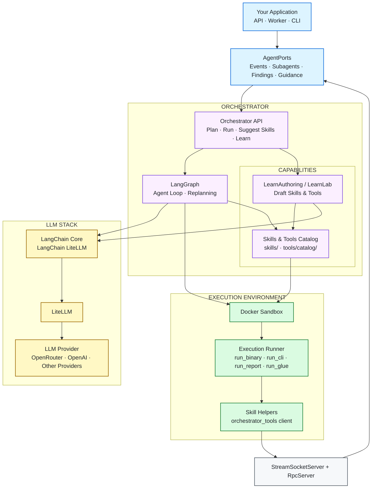

# orchestrator

A reusable objective-based deterministic enough agent runtime that **plans → executes → recovers → grows**.

## Overview

Orchestrator runs tools and custom Python scripts from a tool catalog or skill asset in isolated sandboxes, so each run stays relatively cheap. Skills and tools live as files under `skills/` and `tools/catalog/`. Your app implements `AgentPorts` for events, subagents, and findings.

> **Note:** The planner and objectives model were built for security projects, but the same runtime works for other scopes—swap the skill/tool catalog and prompts to fit the domain.

**Skills format:** Skill directories follow the open [Agent Skills](https://agentskills.io) (`agentskills`) `SKILL.md` layout (YAML frontmatter + Markdown body, optional `scripts/` / `references/` / `assets/`). Orchestrator extends that with product fields under `metadata:` (category, jobable, lifecycle, requires_clis, …) and standardized `scripts/run.py` entrypoints.

## How it works

With LangGraph, Orchestrator takes a prompt, plans objectives, provisions a sandbox with the needed tools (from the catalog or skill descriptions), and executes—using (sub)agents as needed. On failure it replans to recover and resume. An Analyzer agent always runs at the end and drafts a markdown report from findings. After a run, the host can call `suggest_skills` with the project brief or findings to recommend the next skills to run.

```text
prompt → plan → sandbox → provision → execute → recover → result → suggest next skills
```



## Features

| Feature | Description |
|---|---|
| **Add tools or skills easily** | Draft new skills and tools from a single prompt, or add them as files. |
| **Suggest next skills** | Pass the brief or findings to `suggest_skills` after a run. Example skills here were created by Orchestrator after runs. |
| **Skill entrypoints** | Each skill’s `scripts/run.py` uses a built-in runner. The available entrypoints are:<br>• **run_binary**: Executes a compiled binary or executable file.<br>• **run_cli**: Runs a shell command-line interface, suitable for scripts or tools invoked from the shell.<br>• **run_report**: Gathers results and generates a markdown report from the skill's output.<br>• **run_glue**: Orchestrates multiple steps or tools in a single run, acting as a workflow or integration runner. |
| **Skill linting** | `SkillLinter` / `lint-skill` checks Agent Skills layout (`SKILL.md` frontmatter, name/dir match, body refs) plus product `metadata:` so drafts and catalog skills stay compatible. |
| **Flexible installs** | Install recipes: `apt`, `github_release`, `git_clone`, `pip`, or `custom` bash script.<br>Tool install priority:<br>&nbsp;&nbsp;• catalog<br>&nbsp;&nbsp;• if the tool is not in catalog, fallback to Skill instructions<br>&nbsp;&nbsp;• if a failure is detected due to missing tool, replan (LLM) |
| **Tested tool installs** | Validate each new recipe in a learn-lab sandbox before production provision. |
| **Live Streaming capability** | Library ships Unix **stream** + **RPC** servers (`StreamSocketServer`, `RpcServer`). Skill helpers in `skills/helpers/orchestrator_tools.py` are the matching clients (`ORCHESTRATOR_STREAM_SOCKET` / `ORCHESTRATOR_RPC_SOCKET` + `ORCHESTRATOR_RPC_TOKEN`). This allows custom tools/scripts to stream live updates to a listeneting UI element in a dashboard |
| **Extend as data** | Add a skill or catalog YAML with no code changes. |
| **Recover & steer** | Auto-retry on errors; operators can inject live guidance to steer or replan. |
| **Safe learning** | Draft new tools or skills, lab-test, then approve for use. |

## API surface

**Mechanics:** `plan()` / `run()` / `suggest_skills()` · `provision_cli` cascade (catalog → skill `INSTALL.md` → LLM) · failure nudges + `drain_operator_guidance()` · Learn (`suggest_tool` / `write_skill` / `LearnLab`) · skill runners + stream/RPC sockets.

**Caps:** sandbox (`provision_cli`, `run_cli`, `run_code`, …) · skills (`run_skill_script` → `scripts/run.py`, …) · host ports (objectives, findings, subagents) · optional stream/RPC bridge.

## Usage

Use `examples/thin_client.py` (one-shot or interactive).

```bash
pip install -r requirements.txt && cp .env.example .env   # set OPENROUTER_API_KEY

# Plan (no sandbox)
python examples/thin_client.py plan "probe example.com with httpx"

# Draft a catalog tool (YAML + install recipe; optional learn-lab test)
python examples/thin_client.py suggest-tools "add ffuf fuzzer"

# Draft a new skill (LLM + linter; may also suggest a missing tool)
python examples/thin_client.py draft-skill "http banner grabber using curl"

# Execute in Docker
python examples/thin_client.py run "probe example.com with httpx" --plan-first --remove

# Catalog helpers
python examples/thin_client.py list-skills
python examples/thin_client.py list-tools
python examples/thin_client.py suggest-skills "scan ports with nmap"
python examples/thin_client.py lint-skill domain-enum
python examples/thin_client.py test-tool tools/catalog/httpx.yaml
```

```python
from orchestrator import LearnAuthoring, Orchestrator

orch = Orchestrator()
orch.plan("probe example.com with httpx")
orch.run("probe example.com", plan_first=True, remove_sandbox=True)
LearnAuthoring.suggest_tool("add ffuf fuzzer")
LearnAuthoring.write_skill("http banner grabber using curl")
```

Docker is required for `run` / Learn lab / `provision_cli`. Env: see `.env.example`. Layout: `src/orchestrator/{agent,tools,runtime,skills,learn}` · sample `skills/` · `tools/catalog/`.
